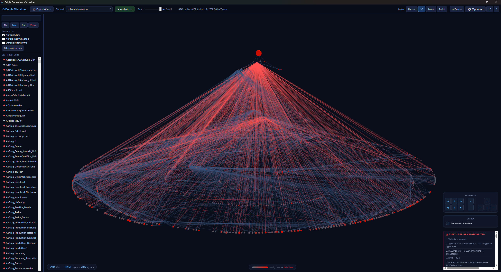

# Delphi Dependency Visualizer

Interactive 3D visualization of Delphi unit dependencies. Analyzes `.dpr` projects and renders the dependency graph in a navigable 3D view — including circular dependency detection and heatmap coloring.



## Features

- **4 layout modes** — Layered, 3D Force, Tree, Radial
- **Heatmap coloring** — units with many dependencies glow red
- **Circular dependency detection** — listed and highlighted
- **Filters** — show only Forms, DataModules, or cyclic units
- **Adjustable depth** — limit analysis to N levels
- **Self-contained** — no .NET installation required

## Requirements

- Windows 10 / 11 (x64)
- [WebView2 Runtime](https://developer.microsoft.com/en-us/microsoft-edge/webview2/) (pre-installed on Windows 11)

## Installation

Download the latest installer from [Releases](../../releases) and run it. No admin rights required.

## Usage

1. Click **Projekt öffnen** and select a `.dpr` file
2. Choose a start unit and analysis depth
3. Click **Analysieren**
4. Navigate with mouse: rotate, zoom, click nodes for details

## Build from source

```bat
build.bat
```

Requires [.NET 8 SDK](https://dotnet.microsoft.com/download).
